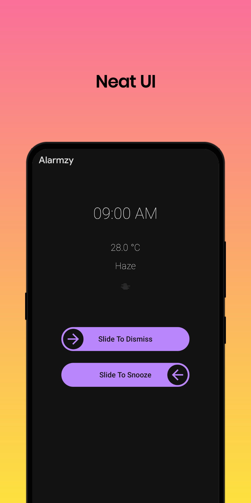
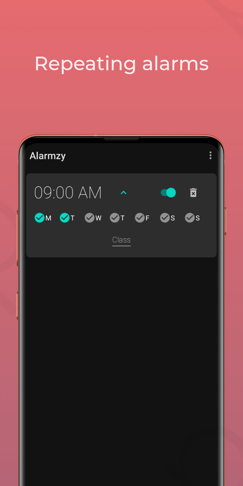
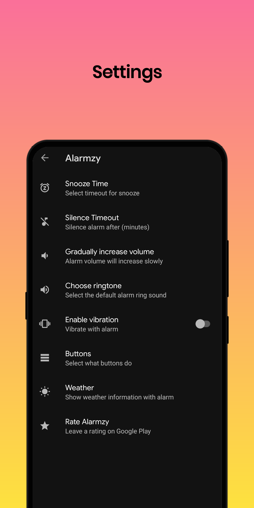

# Alarmzy

Alarm Clock app with all essential features and no ads

  

# Screenshots

   

# Features

- Multiple / Recurring alarms
- Customizable silence timeout
- Notifies about missed and snoozed alarms
- Snooze alarm from 1-30 minutes
- Enable / Disable vibration
- Set alarm label / reason 
- Slide to snooze / dismiss alarm
- Swipe to delete alarm
- Gradually increase alarm volume

* Translate Alarmzy in your language:
https://crowdin.com/project/alarmzy
